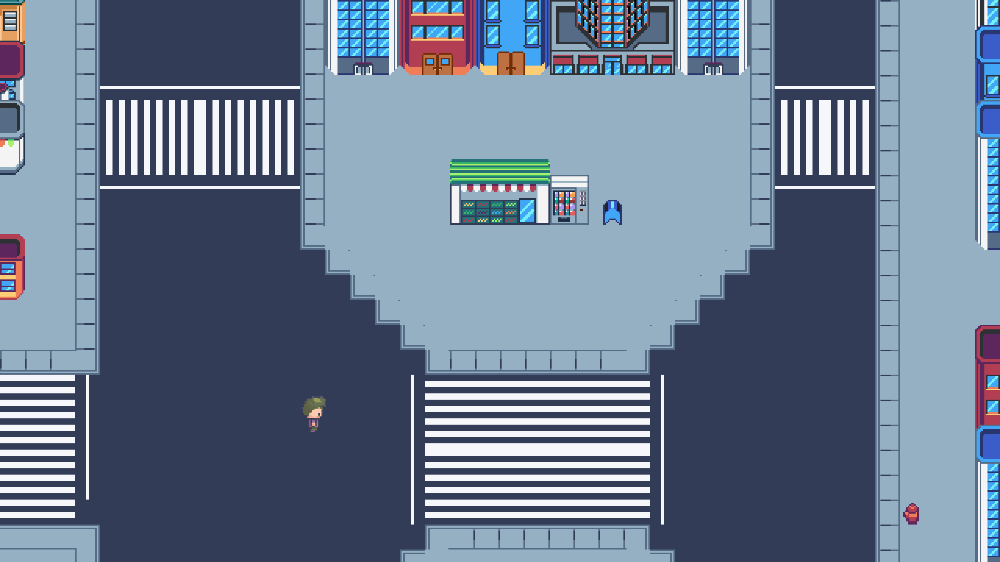

# Documento de diseño de videojuego: Guerra de abrazos

Versión del documento: 0.1.0
Cambios en esta versión: Se pueden visualizar en el repositorio de [git](https://github.com/dipzza/pld-practicas)
Autores: Francisco Javier Bolívar Expósito y Juan Helios García Guzmán

## Objetivos del Juego

El juego es un 2D Top-Down party game en el que los jugadores compiten por dar más abrazos empujando y moviendose. El juego está dirigido a todos los públicos que quieran jugar con dos o más amigos en el mismo dispositivo. Especialmente hecho para jugar casualmente en fiestas con personas de todas las edades. El juego dará la sensación de un bullet hell, con movimiento rápido para llegar a los recursos antes que los demás siendo así un competito tanto local como online, de esta manera el juego proporcionará partidas rápidas y divertidas que den ganas de seguir jugando. 

## Resumen de la historia

El juego se sitúa dentro de una ciudad en el presente dónde todo el mundo tiene que ir y acelerado del trabajo a casa y de casa al trabajo. Unos futuros compañeros de piso pertenecientes al secreto sindicato del amor deciden que se quedará con la habitación más grande aquel que cumpla mejor sus labores antisistema. Estas labores se resumen en abrazar y dar cariño a los transeuntes que pasan. Los jugadores eligen donde comenzarán sus actividades pero solo podrán hacerlas durante un corto periodo ya que de lo contrario podrían ser detenidos. Después de terminar cada uno hace recuento de cuanto "cariño" ha dado para así decidir quien va ganando en la carrera por cambiar el mundo y también por elegir la habitación.

## Pantalla de inicio
En la pantalla de inicio del juego se verá el título del juego en grande y una serie de submenús que incluirá el acceso al multijugador local y el multijugador online. 

## Flujo de menús
A partir de la pantalla de inicio se puede entrar en los distintos menús de multijugador. Una vez se elige el modo se tendrá que crear una partida determinando el número de jugadores que será entre 2 y 4, un tiempo de juego que será entre 40s y 2 min y un nivel de juego (por ahora solo existirá uno). En el multijugador local una vez creada la partida aparecerá un lobby donde se podrán ir uniendo los distintos jugadores para luego comenzar cuando todos estén de acuerdo en hacerlo. Una vez que hayan empezado se les verá en la pantalla principal del juego.

## Cámaras del juego

Camara top-down fija de todo el nivel.

## HUD
En el HUD aparece la puntuación que lleva cada jugador y el tiempo hasta que termine la ronda del nivel actual.

## Personajes del juego
Dentro del juego tenemos dos tipos de personajes los jugables y no jugables.

### Personajes jugables
Los personajes jugables tienen como objetivo dar abrazos para ganar el juego, son miembros del sindicato del amor y compañeros de piso entre sí. Aunque tengan diferentes aspectos poseen las mismas habilidades.

### Personajes no jugables
Los personajes no jugables son los recursos que tienen que ser abrazados, hay distintos tipos según dan más o menos puntos:

- Persona normal: Solo se le puede abrazar una vez ganando un punto. Una vez que ha sido abrazado abandona el mapa a mayor velocidad
- Persona especialmente triste: Se le puede abrazar de forma continuada hasta que abandona el mapa. El mantenerse cerca de él hace que se le pueda dar abrazos aunque tenga un cooldown.
- Persona especialmente inabrazable: No se le puede abrazar y al tocarle baja puntos. 

## Flujo del juego

Una vez se inicia el juego empiezan a aparecer por el mapa personas que se van moviendo, estos son los recursos a conseguir por los jugadores que deben de situarse cerca suya para conseguir "abrazarlos". Dependiendo de los atributos visuales de estas personas se sabe que dan más o menos puntos o que dan puntos de forma continuada, es decir que se corresponden con cada uno de los NPC. El jugador que se sitúe cerca de él le da un abrazo y gana un punto. Para los que pueden ser abrazos de forma continuada hay un cooldown que esperar a su alrededor para que vuelva a haber un abrazo. Los jugadores deberán de acumular el máximo de abrazos dados durante un periodo de tiempo fijable en la pantalla de lobby. Una vez termine este tiempo los jugadores se volverán a reunir en el lobby donde saldrán las puntuaciones obtenidas en el nivel jugado. 

## Habilidades de los personajes
Los personajes pueden usar diversas habilidades para conseguir dar abrazos y evitar que los den sus compañeros: 

- **Proyectil**. Se puede lanzar y al colisionar empuja a su alrededor a otros jugadores.

- **Abrazar**. Al colisionar con otro jugador ambas entran en un estado de abrazo, continuando ambos a la misma velocidad durante la duración del abrazo, siendo esta la suma de sus velocidades anteriores individuales. Al finalizar el abrazo los participantes son empujados para separarlos.

- **Dash**. Rápido movimiento para cambiar de dirección o sitio, si dasheas en un abrazo de otros jugadores lo cortas.

## Controles del juego
### Teclado
Podrían jugar hasta dos jugadores en un solo pc. Uno con el esquema de controles A y otro con el B. Si hay juego online por cada pc podrán jugar 2 jugadores.

+ Movimiento direccional. A - WASD, B - Flechas.
+ Dash. A - Espacio, B - Enter.
+ Lanzar proyectil. A - Mayús izquierdo. B - Mayús derecho.

### Mando
Para varios jugadores se podrían conectar varios mandos

+ **Movimiento direccional**: Joystick izquierdo
+ **Dash**: L1 y X
+ **Proyectil**: R1 y Cuadrado

## Puntuación
La puntuación equivale al número de abrazos que ha dado el jugador.

## Fin de partida 

Se muestra una tabla de resultados mostrando primero al que haya ganado. 

## Recompensas

Por el momento no se tienen pensado ninguna recompensa especial.

## Progresión en el juego

Por el momento no se tiene pensada ninguna progresión específca

## Niveles 
De momento solo se hará un nivel que transcurrirá en un cruce de una ciudad. Con el tiempo se tiene pensado añadir distintos mapas para que la competición por la habitación más grande transcurra en distintos espacios. 

## Música

Por ahora no se ha escogido pero el juego llevará música que acompañe a los movimientos de los jugadores.